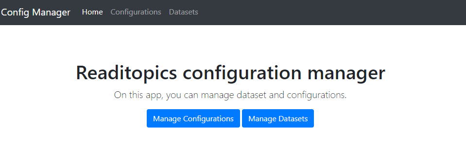
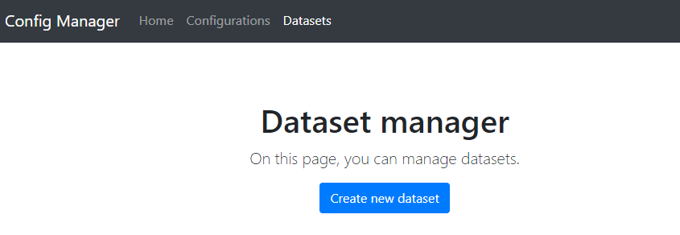
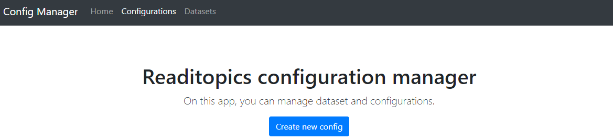
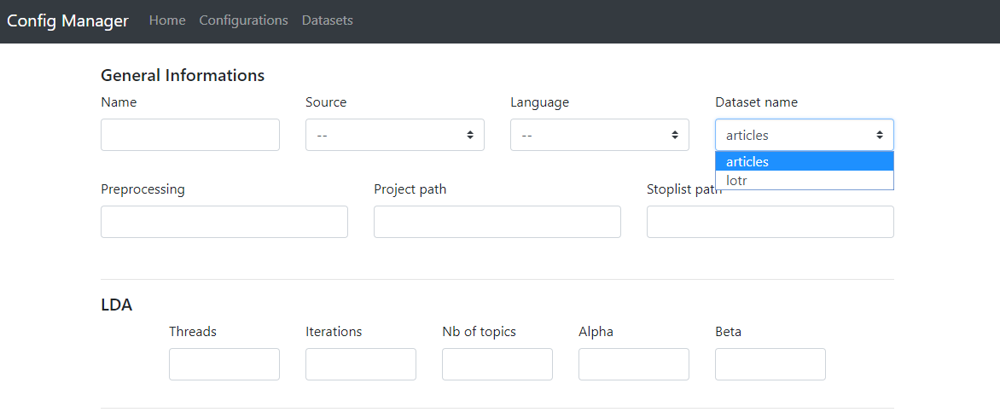
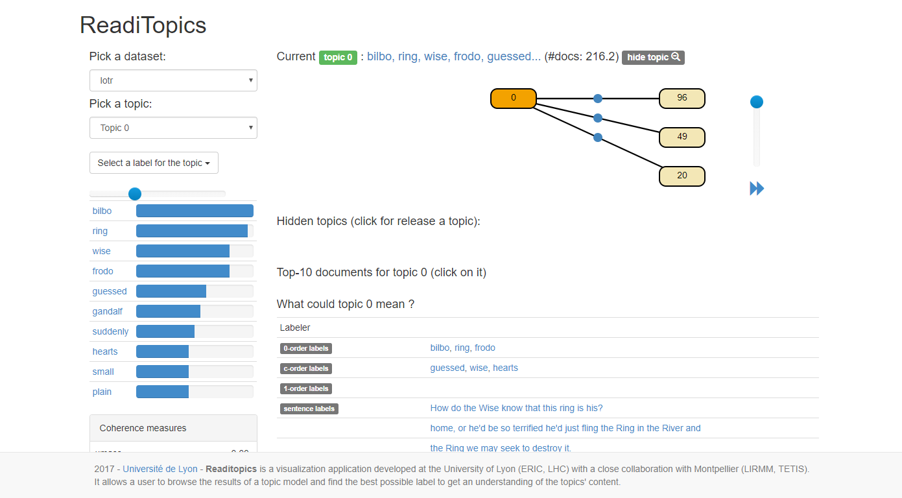

# Readitopics Installation Guide


## Dependencies

In order to use Readitopics, you will need two dependencies :
- Java 8 : https://www.java.com/en/download/
- Perl 5 : https://www.perl.org/get.html

Verify you have Java and Perl installed by doing :
````
java -v
perl -v
````

## Workspace description

This documentation file must be located with other files and folders :

- Biotex/
- config/
- data/
- resultats/
- WebServer/
- TreeTagger/
- en-sent.bin
- readitopics.jar

You must keep these files within in the same folder (but you can move the folder).

#### Biotex
blablabla

#### config
Contain the configuration files

#### data
Contain the datasets used by the algorithm

#### resultats
Contain some intermediary results. You may need to clean it, because some analysis wont run if a result have already
been computed

#### WebServer
Contain some data used by the WebServer

#### TreeTagger
blablabla

#### en-sent.bin
blablablabla

#### readitopics.jar
The program to use.


## Usage

Readitopics is composed by many sub-programs, allowing the user, for exemple, to :

- load a dataset
- manage configurations
- run latent dirichlet allocation on the dataset
- run some topic labeling algorithms
- visualize the result via a web interface

### Step 1 : Config / Dataset management

First you need to start the ConfigServer tool, by running the following command :
````
java -cp readitopics.jar exe.ConfigServer
````
Then, go to <localhost:8000> :

 

Go to the [Datasets page](localhost:8000/datasetList.html).

 

Click on Create new Dataset, then select a zip file, containing your dataset, and upload the dataset.
 

We use the zip format in the upload, in order to handle multiple-file datasets.

Now go on the [Configurations Page](localhost:8000/configList.html) :



Create a new Config :



Select the dataset you uploaded (ex : my_dataset), and set :

- the name of the configuration (ex : my_name)
- the source (folder.books if your dataset is just text files in a folder, csv if it's a csv file)
- the language of the dataset (english / french / spanish)
- the preprocessing operations
- the project path (by default ".", don't modify it if you follow this tutorial)
- the stoplist path : a path (relative) to a list of stop words

You also have to set some LDA parameters :

- the number of threads (ex : 8 for a 4-cores processor, like an Intel Core i5 , more if you have)
- the number of iterations (default : 200)
- the number of topics (default : 20)
- alpha & beta : LDA priors

Then press "Create Config Button".

You have created a configuration file named *config.my_name*, accessible at *config/config.my_name*. 

Now, shut down the ConfigServer in the command line (cmd-C on Mac, Ctrl-C on windows).

### Step 2 : Build the vocabulary

Run the following command :

````
java -cp readitopics.jar exe.BuildVocab config/config.my_name
````

### Step 3 : Run LDA

Run the following command :

````
java -cp readitopics.jar exe.RunLDA config/config.my_name
````

This command will create a model in *resultats/my_dataset/models*, with the current date as name. (ex : 2018_04_09)
Remember this date : it is the name of the model ( many models can be trained and stored in *resultats/my_dataset/*).


### Step 4 : Export for visualization

Run the following command :

````
java -cp readitopics.jar exe.Export4Viz config.my_name
````

### Step 5 : Data visualization

Run the following command :

````
java -cp readitopics.jar exe.WebServerMain WebServer/datasets
````

Then go to this url : <localhost:1234>

You can now use the web topic browser :



